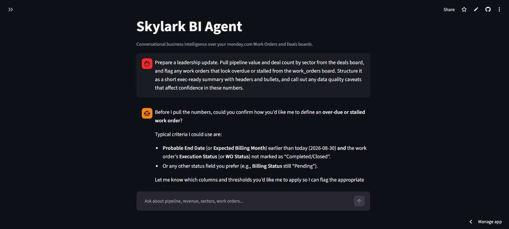
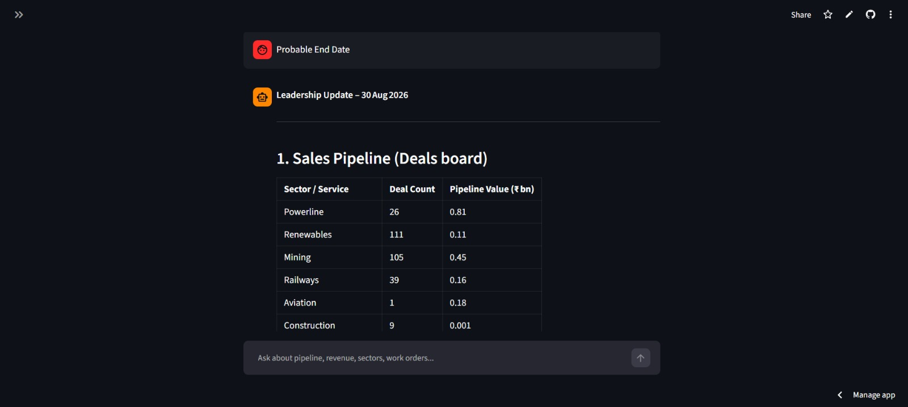

# Skylark BI Agent

A conversational agent that answers founder-level business intelligence
questions by querying two live monday.com boards (**Work Orders** and
**Deals**), cleaning the underlying messy data on the fly, and computing
exact aggregates rather than letting the LLM guess numbers.

> **[Read the Decision Log](DECISION_LOG.md)** for assumptions, trade-offs,
> what I'd do differently with more time, and how "leadership updates" was
> interpreted.

## Screenshots

**Asking a clarifying question instead of guessing**, when "overdue/stalled"
wasn't yet defined against the actual columns:



**One-click leadership update**, pulling a live sector breakdown (deal count
+ pipeline value) straight from the deals board:



## Architecture

```
monday.com boards (Work Orders, Deals)
        │  GraphQL v2 API, read-only, personal token
        ▼
monday_client.py     — raw fetch (schema + items) for a board
        ▼
data_utils.py        — cleaning layer, generic over monday.com column types:
                         • dates parsed / invalid ones flagged, not dropped
                         • numbers stripped of currency symbols/commas
                         • near-duplicate category labels merged
                           ("Energy" / "energy " / "ENERGY" → "Energy")
                         • every gap recorded as a human-readable
                           data_quality_note instead of silently vanishing
        ▼
agent_tools.py        — tools exposed to the LLM:
                         • get_board_data     – inspect cleaned row-level data
                         • compute_aggregate  – exact sum/count/avg/min/max/median,
                                                 optional group_by + filters,
                                                 computed in pandas (not by the LLM)
                         (get_board_schema also lives here, but is called
                         directly by app.py at session start, not by the LLM —
                         see below)
        ▼
app.py (Streamlit)    — chat UI. Fetches both boards' schema live via a plain
                         Python call and bakes it into the system prompt, so
                         the model never spends an API round-trip discovering
                         column names. Groq (`openai/gpt-oss-120b`) then
                         drives a manual tool-calling loop: ask the model,
                         execute any tool_calls it returns, feed results
                         back, repeat until it returns a plain-text answer.
                         Retries with backoff on rate-limit (429) errors.
```

**Why this shape:** the assignment's own framing ("business data is messy",
"provide context... not just raw numbers") pushed the design toward two
non-negotiables — (1) numeric answers must be computed deterministically, not
hallucinated by the model reading a table, and (2) every cleaning step must
leave an audit trail (`data_quality_notes`) that reaches the final answer,
rather than quietly dropping rows.

## Tech stack

| Layer | Choice | Why |
|---|---|---|
| LLM / agent loop | Groq (`openai/gpt-oss-120b`), manual tool-calling loop | Started on Gemini, but its free tier's 5 requests/minute cap made even a single multi-tool-call question unreliable (see below); Groq's free tier (1000 req + a per-minute token budget per model) is far more workable, at the cost of writing the tool-call loop by hand since Groq's SDK doesn't do automatic function calling from Python objects the way `google-genai` does |
| monday.com integration | Direct GraphQL v2 API (`requests`) | Full control, no extra infra, satisfies "MCP or API — your choice" |
| Data cleaning | `pandas` | Fast, expressive normalization/aggregation |
| UI | Streamlit `st.chat_message` | Fastest path to a real conversational UI + free public hosting |
| Hosting | Streamlit Community Cloud | Deploys straight from GitHub, no server management, satisfies "testable without local setup" |

## Setup

1. **monday.com**: import the two CSVs as separate boards (Work Orders, Deals),
   note each board's ID from its URL, and generate a personal API token
   (Avatar → Administration → API).
2. Copy `.env.example` to `.env` and fill in `GROQ_API_KEY`,
   `MONDAY_API_TOKEN`, `MONDAY_WORK_ORDERS_BOARD_ID`, `MONDAY_DEALS_BOARD_ID`.
3. `pip install -r requirements.txt`
4. `streamlit run app.py`

### Deploying (Streamlit Community Cloud)
Push this repo to GitHub → [share.streamlit.io](https://share.streamlit.io) →
"New app" → point at `app.py` → add the same four values from `.env` under
**Secrets** (same `KEY = "value"` format, no quotes needed for numbers) →
Deploy.

## What's implemented
- Live, read-only monday.com querying (no hardcoded CSV data)
- Generic cleaning layer driven by monday.com's own column types
- Deterministic aggregation tool (sum/count/avg/min/max/median, group-by, filters)
- Conversational chat interface with tool-use
- Data quality caveats surfaced in answers
- "Generate leadership update" one-click summary (sidebar button)
- Graceful error handling for monday.com/API failures (returned as JSON
  `{"error": ...}` to the model, which explains the failure to the user
  instead of crashing)

## Known limitations / what I'd improve with more time
- No conversation-level memory of previously fetched data — every question
  triggers a fresh board fetch (fine at this data scale, wouldn't scale to
  large boards).
- Category-label fuzzy-matching (`difflib`) is a heuristic, not perfect —
  a dedicated small classification pass would be more robust for messier text.
- No pagination past 500 items per board.
- No caching layer, so latency scales with monday.com API round-trips.
- **Switched LLM provider mid-build (Gemini → Groq)**, and it's worth being
  honest about why: `gemini-3.6-flash`'s free tier caps out at 5
  requests/minute, and since automatic function calling spends one Gemini
  call per tool round-trip, a single multi-step question could burn the
  entire budget by itself — even after optimizations (baking the schema into
  the system prompt to cut calls-per-question roughly in half) it was still
  not reliable enough to demo. Groq's free tier (1000 requests + a per-minute
  *token* budget per model) has much more headroom. The trade-off: Groq's
  SDK doesn't do automatic function calling from Python objects, so the
  tool-calling loop in `app.py::run_agent` is hand-written (call model →
  check `tool_calls` → execute → feed results back → repeat).
- Groq's free tier still caps `openai/gpt-oss-120b` at **8,000 tokens/minute**
  — tight, since a thorough BI answer (e.g. "how's pipeline for sector X"
  ended up making 5-6 tool calls to check count, value, average, and stage
  breakdown) resends the growing conversation each round-trip and can approach
  that ceiling within a single question. Mitigated by: keeping `get_board_data`
  row limits small (default 15) so row dumps don't dominate the budget, always
  preferring `compute_aggregate` (small JSON responses) over raw rows, trimming
  chat history to the last few turns before each request, and retry-with-backoff
  on 429s (parses the API's suggested wait and retries up to 3 times) so a
  rate limit degrades into a visible "retrying in Ns" instead of a crash. On a
  paid Groq tier this ceiling is far higher; documented here because it's a
  real constraint hit and designed around, not a hypothetical.
- Clarifying-question behavior depends on the model choosing to ask rather
  than guess — good system-prompt discipline helps but isn't a hard guarantee.

See `DECISION_LOG.md` for assumptions, trade-offs, and the interpretation of
"leadership updates."
